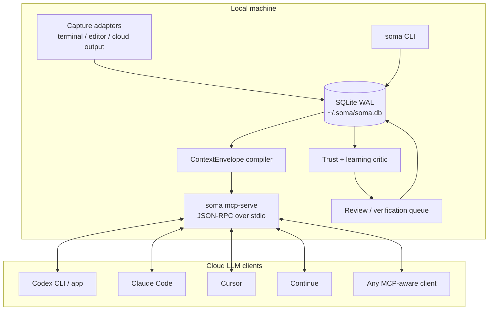
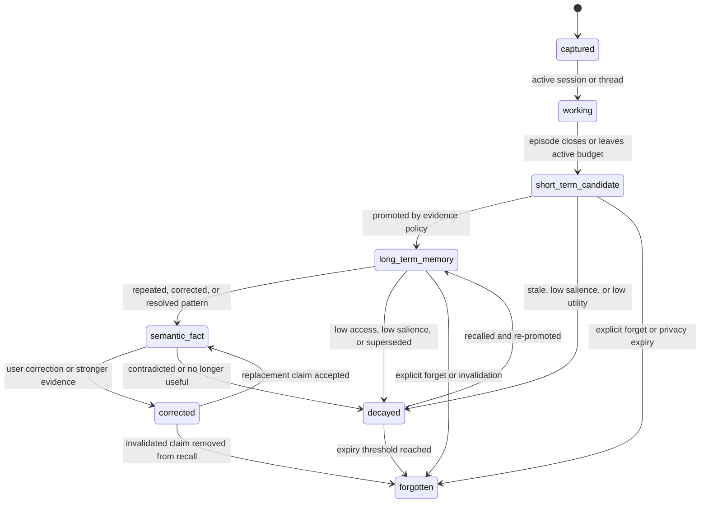

# SOMA

[](LICENSE)
[](LICENSE-docs)
[](rust-toolchain.toml)
[](README.md#storage-model)
[](README.md#mcp-resources-and-tools)
[](README.md#local-dashboard)
[](https://github.com/wnsdy95/SOMA-Public/actions/workflows/ci.yml)
[](SECURITY.md)

**SOMA is a local context, memory, and control plane for cloud LLMs.**

SOMA stands for **Self-Optimizing Memory Architecture**: a local system that
learns from your work history by moving evidence through explicit memory
lifecycle states instead of treating every remembered token as truth.

Cloud LLMs are now strong enough to code, write, refactor, plan, and use tools.
Their weakest point is not raw intelligence. It is continuity: the model often
does not know the current task state, which project constraints matter, which
older assumptions were corrected, which local events are evidence, and which
cloud-generated claims are still unverified.

SOMA owns that missing layer locally.

It captures local work history, keeps it in a private SQLite store, compiles
evidence-backed context, exposes that context through MCP, and prevents cloud
output from becoming durable memory until it is verified by a user, tool, test,
local observation, or correction.

The short version:

```text
Cloud LLM = synthesis, execution, broad reasoning, code/prose generation
SOMA      = local memory, task state, evidence, policy, correction, trust gates
```

SOMA does not try to replace the cloud model. It gives the cloud model the
right cognitive state.

## Current Status

This repository is the public runtime source set:

- single Rust crate: `crates/soma`
- one binary: `soma`
- local SQLite storage under `~/.soma` by default
- MCP server entry point: `soma mcp-serve`
- public adapter/reference scripts under `tools/`
- public contribution, security, PR, and repository governance policy

The public repo intentionally excludes the private development history,
throw-away spikes, legacy multi-process prototypes, internal planning docs, and
large private dogfood artifacts. It keeps only the small `docs/evals/*.json`
snapshots that are compiled into the runtime hardening report. Important
architecture concepts from the private prose docs are summarized here instead.

Repository policy:

- [Contributing](CONTRIBUTING.md)
- [Security policy](SECURITY.md)
- [Support](SUPPORT.md)
- [Code of conduct](CODE_OF_CONDUCT.md)
- [Pull request policy](docs/PULL_REQUEST_POLICY.md)
- [Repository governance](docs/REPOSITORY_GOVERNANCE.md)
- [GitHub setup notes](docs/GITHUB_SETUP.md)

## Installation Guide

Prerequisites:

| Requirement | Notes |
| --- | --- |
| Rust | Minimum supported Rust version is `1.86.0`. The repo includes `rust-toolchain.toml`. |
| SQLite | No separate install or server is needed. SOMA uses bundled SQLite through `rusqlite`. |
| Network | Required only for fetching Rust crates, or for optional embedding/model downloads. |

Clone and build:

```bash
git clone https://github.com/wnsdy95/SOMA.git
cd SOMA
cargo build -p soma
target/debug/soma --help
```

Install the default CLI:

```bash
cargo install --path crates/soma --locked
soma --version
soma --help
```

Install with the local dashboard:

```bash
cargo install --path crates/soma --locked --features dashboard
soma serve --gui --open
```

Install with optional semantic embeddings:

```bash
cargo install --path crates/soma --locked --features embed-onnx
```

Install with dashboard plus optional context-quality modules:

```bash
cargo install --path crates/soma --locked --features "dashboard,cognitive"
```

The heavier optional features are off by default:

| Feature | When to enable |
| --- | --- |
| `dashboard` | You want the local web transparency UI. |
| `embed-onnx` | You want ONNX semantic embeddings through `fastembed`. |
| `cognitive` | You want optional context-quality diagnostics/modules. |
| `cognitive-train` | You are experimenting with trainable optional modules. |
| `pty-capture` | You want advanced PTY terminal capture. |
| `llm-summary` | You need the legacy Anthropic narrative-summary diagnostic. |

Set up shell completions:

```bash
mkdir -p ~/.zsh/completions
soma completions zsh > ~/.zsh/completions/_soma

mkdir -p ~/.config/fish/completions
soma completions fish > ~/.config/fish/completions/soma.fish

soma completions bash > soma.bash
```

Storage is automatic:

- SOMA creates and migrates its SQLite database on first use.
- Default DB path: `~/.soma/soma.db`.
- Override with `SOMA_DB=/path/to/soma.db`.
- Named personas use isolated DBs under `~/.soma/personas/<name>/soma.db`.
- The DB file is local; no Postgres, Redis, server process, or cloud account is
  required.

Start, stop, or inspect the resident runtime when you want always-on local
operation:

```bash
soma start
soma status
soma stop
```

On macOS, install the LaunchAgent for resident operation:

```bash
soma install
soma status
soma uninstall
```

Verify the installed CLI:

```bash
soma diagnose
soma config
soma list
```

Update or remove the installed binary:

```bash
cargo install --path crates/soma --locked
cargo uninstall soma
```

Removing the binary does not delete local memory. Delete `~/.soma` only when
you intentionally want to remove local databases, persona stores, logs, models,
and adapter spool files.

## Usage Guide

The normal SOMA workflow is:

```text
1. Choose or create a persona
2. Activate that persona in a terminal
3. Start a project/session scope
4. Capture local evidence
5. Render or serve ContextEnvelope to a cloud client
6. Capture cloud output as draft claims
7. Verify claims with user/tool/test/local evidence
8. Review learning proposals and promote only verified memory
```

Create and activate a persona:

```bash
soma create research
soma list
eval "$(soma call research --client terminal --project SOMA)"
```

Check active scope:

```bash
soma session status --json
soma projects --brief
soma clients --brief
```

Capture local evidence:

```bash
soma ingest \
  --source terminal \
  --project SOMA \
  --session "$SOMA_SESSION_ID" \
  --command "cargo test" \
  --exit-code 0
```

Recall and render context:

```bash
soma recall --query "what did we decide about ContextEnvelope?"
soma context render --project SOMA --format xml
soma context why --query "ContextEnvelope" --project SOMA
```

Create a TaskFrame before a cloud call:

```bash
soma context task-frame \
  --query "refactor the MCP bridge" \
  --project SOMA
```

Render a cloud-facing prompt artifact:

```bash
soma context prompt \
  --query "refactor the MCP bridge" \
  --project SOMA
```

Connect an MCP client:

```bash
soma mcp-config --client codex-cli
soma mcp-config --client cursor --check --brief
soma mcp-serve
```

Run the dashboard when installed with `dashboard`:

```bash
soma serve --gui --open
```

Capture cloud output as draft claims:

```bash
soma adapter-cloud-output --json payload.json
```

Review and verify claims:

```bash
soma context review-queue --format json
soma context review-actions --format json
soma context verify-claim \
  --claim-id 1 \
  --verifier user \
  --result confirmed \
  --evidence-kind user \
  --evidence-id "manual-confirmation"
```

Inspect trust, learning, and hardening:

```bash
soma learning --brief
soma context trust-audit
soma context audit --project SOMA
soma context hardening-report --json
```

Manage memory lifecycle:

```bash
soma context l2-promote --project SOMA
soma context l2-promote --project SOMA --apply
soma context l3-decay --dry-run
soma forget --help
```

`l2-promote` previews candidates by default. Add `--apply` only when you want
to mutate lifecycle state.

Persona, project, and session rules:

| Scope | Meaning | How to use |
| --- | --- | --- |
| Persona | Isolated learning state and SQLite DB. | `soma create <name>`, then `eval "$(soma call <name>)"`. |
| Project | Provenance inside the persona store. | Pass `--project <name>` or activate with `soma call --project`. |
| Session | Terminal/client continuity marker. | `soma session start`, `soma session attach`, or `soma call --client`. |

Common troubleshooting:

| Symptom | Check |
| --- | --- |
| `soma serve` is missing | Reinstall with `--features dashboard`. |
| Dashboard port is busy | Use `soma serve --gui --port 8766 --open`. |
| Empty dashboard panels | Capture/recall some local evidence first; fresh stores are allowed to be empty. |
| Wrong persona data appears | Run `soma list` and `soma session status --json`; reactivate with `eval "$(soma call <name>)"`. |
| MCP client sees no context | Run `soma mcp-config --client <client> --check --brief` and `soma clients --brief`. |
| A cloud claim should become memory | Use `soma context verify-claim`; cloud drafts do not promote by themselves. |

## Why SOMA Exists

Every serious LLM workflow eventually has the same failure mode:

1. The user explains the project.
2. The model helps.
3. The session ends or context is compressed.
4. The next session forgets subtle constraints.
5. The user re-explains corrections, preferences, decisions, and local state.

SOMA makes those pieces first-class local state:

- recent work and active task continuity
- project and session provenance
- user corrections
- unresolved decisions
- policy-like preferences
- cited episodic evidence
- cloud drafts that still need verification
- durable semantic facts only after evidence gates pass

The goal is not "more prompt text". The goal is better context selection,
evidence, and trust boundaries.

## Design Principles

- **Local first.** The durable memory store is local. Cloud clients receive only
  generated projections, not the raw database.
- **Evidence before memory.** Durable memory must cite local evidence or trusted
  verification. Cloud output alone is a draft.
- **Deterministic baseline first.** Every learning layer has a rule-based path.
  Neural or learned backends are optional context-quality modules, not the core
  product promise.
- **MCP as the bridge.** Cloud/editor clients read ContextEnvelope resources and
  call explicit tools through `soma mcp-serve`.
- **Personas own storage. Projects are provenance.** A named persona/profile has
  its own local DB and adapter spool. Project names describe where experience
  came from inside that persona.
- **Review beats silent mutation.** Promotion, verification, semantic learning,
  and client-binding proof are visible operator workflows.

## High-Level Architecture



The binary is deliberately boring: one Rust executable dispatches the CLI,
resident runtime, capture adapters, and MCP server. There is no required remote
service.

## The Cloud/Local Loop

SOMA is designed for an iterative loop:

```text
SOMA: infer task state, relevant evidence, policy, and open decisions
Cloud: generate a plan, patch, explanation, or draft
SOMA: capture the output as draft claims and critique it against local evidence
User/tool/test/local observation: verify or reject claims
SOMA: promote, correct, decay, or forget memory with cited lifecycle evidence
```

Cloud LLMs remain the high-capacity synthesis engine. SOMA is the local
continuity and evidence engine.

## ContextEnvelope

The primary product artifact is the `ContextEnvelope`: a cited, scoped,
cloud-facing projection of local memory.

It is available through CLI and MCP:

```bash
soma context render --project SOMA --format json
soma context render --project SOMA --format xml
soma mcp-serve
```

Canonical envelope sections include:

| Section | Purpose |
|---|---|
| `thread_state` | current task continuity and active working set |
| `short_term_candidates` | recent L2 candidates, anomalies, conflicts, and latent proxy evidence |
| `project_experience` | projects the active persona has learned from, with provenance |
| `relevant_memory` | cited episodic evidence selected for the query/scope |
| `stable_facts` | verified semantic facts and durable abstractions |
| `user_policy` | evidence-backed user or project preferences |
| `open_decisions` | unresolved conflicts, decisions, and review candidates |
| `corrections` | user/tool/local corrections that suppress stale assumptions |
| `evidence` | top-level evidence references used by cloud-facing sections |

Example shape:

```xml
<soma-context version="1" scope="project" project="SOMA">
  <thread-state evidence="episode:123">
    Current task state and active constraints.
  </thread-state>
  <relevant-memory>
    <item rank="1" layer="semantic" evidence="episode:120 claim:44">
      A cited memory item relevant to this prompt.
    </item>
  </relevant-memory>
  <user-policy>
    <claim status="active" evidence="claim:12 verification:7">
      A stable preference or rule.
    </claim>
  </user-policy>
  <open-decisions>
    <claim status="open" evidence="belief_candidate:9 episode:125 episode:126">
      Something still unresolved.
    </claim>
  </open-decisions>
  <evidence>episode:120, episode:123, claim:12, verification:7</evidence>
</soma-context>
```

## Four-Stage Learning Hierarchy

SOMA's core memory architecture is a four-stage learning hierarchy. The stages
are not marketing labels; they are lifecycle contracts.



Every layer must define:

- storage contract
- promotion rule
- decay/forgetting rule
- evidence rule
- ContextEnvelope projection

| Layer | Role | Transition Basis | ContextEnvelope Projection |
|---|---|---|---|
| L1 Working Memory | active thread/task working set | active session, continuity, budget | `thread_state` |
| L2 Short-term Episodic Cache | recent candidate memory, novelty, anomaly, conflict | recency, salience, anomaly, conflict, candidate expiry | `short_term_candidates`, unresolved `open_decisions` |
| L3 Long-term Episodic Store | durable retrievable evidence | pin, recall frequency, correction/policy/belief reference, anomaly value | `relevant_memory` |
| L4 Semantic Memory | abstracted facts, rules, policies, corrections | repeated verified pattern, correction, resolved conflict, policy extraction | `stable_facts`, `user_policy`, `corrections`, durable decisions |

The 4-stage hierarchy is core. Optional neural or learned backends may assist a
layer only when they improve cited ContextEnvelope output. They never replace
the deterministic baseline or evidence gate.

## Optional Context Quality Modules

The source tree contains optional cognitive modules:

| Module | Current role |
|---|---|
| mLSTM | candidate working-memory selector/compressor for `thread_state` |
| iPC / predictive coding | anomaly or novelty signal for L2 candidates |
| Hopfield | optional retrieval/ranking backend for L3 evidence |
| ANIL-like scope signal | control-plane selector for scope/budget/routing, not a memory layer |

These are implementation candidates. The product proof is whether the
ContextEnvelope becomes more accurate, compact, cited, scoped, and correctable.

## Trust Boundary

SOMA treats sources differently:

| Trust class | Meaning |
|---|---|
| `cloud_draft` | generated by a cloud model; useful as a candidate but not evidence |
| `user_confirmed` | explicitly confirmed by the user |
| `tool_verified` | verified by a tool result or structured local command |
| `test_verified` | verified by a test/eval result |
| `local_observed` | observed from local runtime/editor/terminal evidence |
| `correction` | explicit correction that changes or invalidates prior memory |

Cloud output can be captured:

```bash
soma adapter-cloud-output --json payload.json
```

But it is stored as draft claims. It cannot promote to L3/L4 memory until
verification exists. This prevents the system from laundering hallucinations
into durable memory.

Useful inspection commands:

```bash
soma learning --brief
soma context review-queue --format json
soma context verify-claim --help
soma context trust-audit
soma context hardening-report --json
```

## TaskFrame

A `TaskFrame` is SOMA's local pre-call understanding of a task:

- what the task is
- which project/session/persona scope applies
- what evidence is relevant
- which local-private fields are safe to project to a cloud model
- which constraints and open decisions should shape the request

SOMA persists both a local full form and a cloud-redacted projection policy.
Secret-like or blocked fields fail closed before cloud projection.

```bash
soma context task-frame --query "refactor the MCP bridge" --project SOMA
```

## Personas, Projects, and Sessions

Named personas isolate local SOMA learning state:

```bash
soma create research
soma list
eval "$(soma call research --client codex-cli --project SOMA)"
```

The persona/profile owns:

- SQLite DB path
- adapter spool paths
- local policy/corrections/memory

The project is provenance inside that persona store. This mirrors how a person
learns from multiple projects without pretending each project is a separate
mind.

Useful commands:

```bash
soma projects --brief
soma session status --json
soma clients --brief
```

## Local Dashboard

The dashboard is optional and feature-gated. Default builds do not expose
`soma serve`, so build or install SOMA with the `dashboard` feature first.

Build and run from the repository:

```bash
cargo run -p soma --features dashboard -- serve --gui --open
```

Or build once, then run the binary:

```bash
cargo build -p soma --features dashboard
target/debug/soma serve --gui --open
```

Install a dashboard-enabled binary:

```bash
cargo install --path crates/soma --features dashboard
soma serve --gui --open
```

What starts:

- `soma serve --gui` starts the local web server and blocks until `Ctrl-C`.
- The browser opens automatically when `--open` is passed.
- Default address: `http://127.0.0.1:8765`.
- Use `--port` when the default port is busy.
- Use `--bind` only when you understand the security boundary. The default is
  localhost. Binding to `0.0.0.0` exposes the dashboard to the local network,
  and v1.x has no authentication layer.

Examples:

```bash
soma serve --gui
soma serve --gui --open
soma serve --gui --port 8766 --open
soma serve --gui --bind 127.0.0.1 --port 9000
```

There is no separate backend to start. The dashboard command itself starts the
Rust/Axum backend and serves both the HTML UI and the JSON API routes. The
resident runtime is also not required just to view the dashboard, although
running clients or adapters may separately use the resident runtime.

SQLite is automatic:

- SOMA uses local SQLite; no Postgres, Redis, or external DB service is needed.
- Dashboard DB resolution follows the active SOMA environment: `SOMA_DB` when
  set, otherwise `~/.soma/soma.db`.
- `soma call <persona>` sets `SOMA_DB`, so a dashboard launched from that shell
  reads that persona's isolated store.
- On first use, SOMA creates the parent directory, creates the SQLite file,
  applies pragmas, and runs migrations.

Persona-scoped dashboard example:

```bash
soma create research
eval "$(soma call research --client terminal --project SOMA)"
soma serve --gui --open
```

The dashboard tabs are:

| Tab | What it shows |
| --- | --- |
| Operations | Client binding readiness, current project/persona scope, dogfood status, and semantic learning review state. |
| Quality | Optional module diagnostics mirrored from `soma inspect weights`. Empty rows are acceptable on fresh installs. |
| Recall | Recent recall traces from local recall activity. Empty state is normal before recall has run. |
| Memory | Memory state, policy/correction candidates, corroborations, contradictions, and note-pin timeline. |
| Architecture | Interactive diagram of the ContextEnvelope bridge and local memory path. |

Dashboard API routes:

| Route | Purpose |
| --- | --- |
| `/health` | Liveness check. |
| `/api/operations/status` | Read-only operations/readiness snapshot. |
| `/api/quality/weights` | Read-only quality/weight diagnostics. |
| `/api/training/weights` | Historical alias for quality diagnostics. |
| `/api/recall/recent` | Recent recall trace snapshot. |
| `/api/memory/state` | Memory state snapshot. |
| `/api/memory/timeline` | Recent note-pin timeline. |

Useful fallbacks when the dashboard cannot bind a port:

```bash
soma clients --brief
soma projects --brief
soma learning --brief
soma inspect weights
```

## MCP Resources and Tools

Run the MCP server:

```bash
soma mcp-serve
```

Common resources:

- `soma://context/current`
- `soma://context/by-query?q=<text>`
- `soma://context/project/<name>`
- `soma://context/session/<session_id>`
- `soma://context/thread/<thread_key>`

Common MCP tools include:

- `soma_recall`
- `soma_capture_turn`
- `soma_capture_cloud_output`
- `soma_verify_claim`
- `soma_review_queue`
- `soma_review_actions`
- `soma_review_report`
- `soma_review_render`
- `soma_review_action`
- `soma_context_why`
- `soma_context_audit`
- `soma_trust_boundary_audit`
- `soma_product_hardening_report`

MCP reads and explicit writes are the bridge. Prompt-prefix injection is not the
primary acceptance path.

## Client Integration Model

SOMA supports conservative integration with:

- Claude Code
- Codex CLI
- Codex app
- Cursor
- Continue
- generic MCP clients

The important distinction:

- MCP registration proves a client can read/query/inspect SOMA.
- Explicit capture proves a client or wrapper submitted a turn.
- Private app readiness requires stronger proof: app hook, in-client render,
  and review-action evidence must replay cleanly.

SOMA does not claim that a private editor integration works just because a
config file exists.

```bash
soma mcp-config --client codex-cli
soma mcp-config --client cursor --check --brief
soma clients --brief
soma adapter-binding-proof --client cursor --proof-session --brief
```

Reference adapter assets live in `tools/`:

- `tools/client-bindings/*.json.example`
- `tools/soma-adapter-*.sh`
- `tools/soma-codex-*.sh`
- `tools/soma-client-*.sh`
- `tools/soma-review-*.sh`
- `tools/soma-continue-devdata-*.py`

## Common Recipes

Fresh local setup:

```bash
cargo install --path crates/soma --locked
soma create default
eval "$(soma call default --client terminal --project my-project)"
soma diagnose
```

Dashboard setup:

```bash
cargo install --path crates/soma --locked --features dashboard
eval "$(soma call default --client terminal --project my-project)"
soma serve --gui --open
```

Cloud-client setup:

```bash
soma mcp-config --client codex-cli
soma mcp-config --client cursor --check --brief
soma clients --brief
```

Daily context loop:

```bash
soma ingest --source terminal --project my-project --session "$SOMA_SESSION_ID" \
  --command "cargo test" --exit-code 0
soma context render --project my-project --format xml
soma context review-queue --format json
soma context trust-audit
```

## Command Reference

`soma --help` is the source of truth for exact flags. This section lists the
public command surface and explains what each command is for.

Global flags:

| Flag | Meaning |
| --- | --- |
| `--color <auto,always,never>` | Control diagnostic color output. `auto` respects `NO_COLOR` and TTY detection. |
| `-v`, `-vv`, `-vvv` | Increase logging verbosity from info to debug to trace. `RUST_LOG` still wins. |
| `-q`, `--quiet` | Lower base logging to warnings. |
| `-h`, `--help` | Print help for the selected command. |
| `-V`, `--version` | Print the SOMA version. |

Top-level commands:

| Command | Purpose |
| --- | --- |
| `soma list` | List named local personas and their isolated stores. The active persona is marked in human output. |
| `soma create <name>` | Create a named persona under `~/.soma/personas/<name>/` with its own private `soma.db`. |
| `soma call <name>` | Print shell exports that activate a persona for the current terminal. Alias: `soma activate <name>`. |
| `soma start` | Start the resident runtime in the foreground. |
| `soma stop` | Ask the resident runtime to shut down. |
| `soma status` | Report resident runtime and feature status. |
| `soma session ...` | Manage shell-visible session scope for multi-terminal work. |
| `soma install` | Install the LaunchAgent for always-on resident operation. |
| `soma uninstall` | Remove the LaunchAgent. |
| `soma ingest` | Record an AI interaction or terminal episode into the active store. |
| `soma adapter-capture` | Record one normalized editor or CLI adapter turn through the ingest pipeline. |
| `soma adapter-cloud-output` | Capture cloud output as untrusted draft claims tied to a TaskFrame. It does not promote claims without later verification. |
| `soma adapter-lifecycle` | Normalize one raw editor lifecycle event into SOMA's adapter spool contract. |
| `soma adapter-spool` | Drain a checkpointed JSONL spool of normalized adapter events. |
| `soma adapter-spool-append` | Append one normalized event to an adapter JSONL spool without directly ingesting it. |
| `soma adapter-binding-proof` | Record observed proof for a client binding, render proof, or review-action proof. |
| `soma clients` | Read-only readiness report for Claude Code, Codex CLI, Codex app, Cursor, and Continue. |
| `soma learning` | Read-only semantic learning and L4 review readiness report. |
| `soma projects` | Show project provenance accumulated inside the active persona store. |
| `soma recall` | Recall ranked local episodes for inspection. |
| `soma context ...` | Render, audit, verify, and operate on ContextEnvelope, TaskFrame, review, and learning surfaces. |
| `soma config` | Print resolved local configuration. |
| `soma inspect` | Inspect local context store diagnostics. |
| `soma forget` | Delete stored context episodes through the audited forgetting path. |
| `soma mcp-serve` | Serve MCP resources over stdio for Claude Code, Codex CLI, Codex app, Cursor, and Continue. |
| `soma mcp-config` | Generate or check dry-run MCP registration JSON for supported clients. |
| `soma diagnose` | Print one support/debug JSON object with version, features, liveness, DB stats, envelope disposition, and failures. |
| `soma backfill` | Backfill primary embedder vectors after an embedder or index change. |
| `soma logs tail` | Print the last lines of SOMA's rolling local log file. |
| `soma completions <shell>` | Emit shell completion scripts for bash, zsh, fish, elvish, or PowerShell. |
| `soma help [command]` | Print command help. |

Session commands:

| Command | Purpose |
| --- | --- |
| `soma session start` | Start a SOMA-managed shell session and print eval-able exports. |
| `soma session attach` | Attach the current shell to an existing SOMA session id. |
| `soma session status` | Show SOMA session variables visible to the current process. |
| `soma session clear` | Print commands that clear SOMA session variables from the shell. |

Context commands:

| Command | Purpose |
| --- | --- |
| `soma context render` | Render a scoped ContextEnvelope for inspection or tooling. |
| `soma context prompt` | Render a cloud-facing artifact containing a TaskFrame plus ContextEnvelope. |
| `soma context task-frame` | Build and persist a deterministic TaskFrame for inspection. |
| `soma context task-frames retention` | Report or apply retention for old unreferenced TaskFrames. |
| `soma context task-frames outcomes` | List evidence-backed TaskFrame outcome records. |
| `soma context task-frame-outcome` | Record an evidence-backed outcome for a persisted TaskFrame. |
| `soma context l3-decay` | Inspect or apply stale, low-access L3 proxy decay policy. |
| `soma context l2-promote` | Promote eligible L2 latent proxies to L3 through explicit lifecycle policy. |
| `soma context latent-predict` | Predict active evidence-backed latent proxies for a query without mutating memory. |
| `soma context latent-packet` | Render an inspectable latent interface packet for future cloud latent channels. |
| `soma context latent-eval` | Score latent predictor hits against JSONL or storage-derived evidence cases. |
| `soma context thread-identity` | Preflight or confirm stable session-to-thread identity. |
| `soma context correct` | Record a user correction so future ContextEnvelopes can cite it. |
| `soma context verify-claim` | Record user, tool, test, or local verification for a claim record. |
| `soma context learning-proposals list` | List learning critic proposals for review. |
| `soma context learning-proposals apply` | Apply one proposal through verification and lifecycle gates. |
| `soma context learning-proposals apply-ready` | Apply all currently ready proposals through the same gates. |
| `soma context learning-proposals set-status` | Mark a proposal accepted, rejected, or waiting for external review. |
| `soma context review-queue` | Show pending claim verification and proposal review work. |
| `soma context review-actions` | Flatten review queue work into client action options. |
| `soma context review-batch-template` | Build a read-only `soma_review_batch` payload template from review actions. |
| `soma context review-report` | Render a read-only human review report with queue, action, and batch guidance. |
| `soma context review-digest` | Render a compact read-only client notification digest. |
| `soma context review-digest-ack` | Acknowledge a rendered digest without changing trust. |
| `soma context review-render` | Compile a read-only client-specific review rendering plan. |
| `soma context review-drain` | Drain safe review work through the verified non-destructive policy. |
| `soma context scheduler-run` | Run selected review and learning scheduler passes through existing gates. |
| `soma context semantic-proposals` | Propose L4 semantic promotions from repeated verified L3 evidence. |
| `soma context open-decision-proposals` | Create review proposals from unresolved L2 open-decision signals. |
| `soma context review-action` | Take one action on a review queue claim or proposal. |
| `soma context review-batch` | Record a verification-only batch of review actions. |
| `soma context audit` | Audit ContextEnvelope evidence and optional TaskFrame privacy projection. |
| `soma context trust-audit` | Audit persisted claim and proposal trust-boundary invariants. |
| `soma context hardening-report` | Compose release and client hardening gates from existing read-only audits. |
| `soma context why` | Explain why ContextEnvelope sections were included, with evidence. |

Diagnostics and support:

| Command | Purpose |
| --- | --- |
| `soma inspect episode --id <id>` | Inspect one stored episode. |
| `soma inspect vector --id <id>` | Inspect vector state for one episode. |
| `soma inspect pin --id <id>` | Inspect pin/lifecycle state for one episode. |
| `soma inspect edges --id <id>` | Inspect graph edges for one episode. |
| `soma inspect weights` | Inspect ranking and recall weight shapes. |
| `soma inspect narrative` | Legacy context/profile diagnostic. |
| `soma inspect centroid` | Legacy context/profile diagnostic. |
| `soma logs tail [-n N]` | Read the last `N` lines of the rolling local log. |

MCP configuration commands:

| Command | Purpose |
| --- | --- |
| `soma mcp-config --client <client>` | Emit one MCP config for `claude-code`, `codex-cli`, `codex-app`, `cursor`, or `continue`. |
| `soma mcp-config --all` | Emit an aggregate report for all supported MCP clients. |
| `soma mcp-config --check` | Validate generated config and print a readiness report. |
| `soma mcp-config --hook-plan` | Include a read-only hook/watcher plan without installing private editor hooks. |
| `soma mcp-config --brief` | Render a compact human handoff instead of JSON. |

Advanced, hidden, or feature-gated surfaces:

| Command | Availability | Purpose |
| --- | --- | --- |
| `soma persona list/create/call` | Hidden compatibility namespace | Alias family for root-level `soma list`, `soma create`, and `soma call`. |
| `soma persona read/regen/inject` | Hidden legacy diagnostic | Legacy context/profile helper artifacts for migration and debugging. |
| `soma profile` | Hidden diagnostic | Legacy context-profile diagnostic; core clients should use `soma context render` or MCP resources. |
| `soma synthesize-narrative` | Hidden diagnostic | Force the legacy slow-loop narrative diagnostic. |
| `soma sync-claudemd` | Hidden migration helper | Splice legacy debug/migration context into `CLAUDE.md`; MCP resources are preferred. |
| `soma capture --pty` | Build feature `pty-capture` | Spawn a shell in a PTY and capture terminal commands through OSC 133 boundaries. |
| `soma serve --gui` | Build feature `dashboard` | Run the optional local dashboard/debug GUI on localhost. |
| `soma context compare-ranking` | Build feature `cognitive` | Compare default HNSW ranking with opt-in Hopfield ranking at the ContextEnvelope boundary. |

Build feature summary:

| Feature | Meaning |
| --- | --- |
| `pty-capture` | Terminal PTY capture. |
| `embed-onnx` | ONNX semantic embeddings through `fastembed`. |
| `cognitive` | Optional context-quality modules. |
| `cognitive-train` | Trainable variants for optional modules. |
| `dashboard` | Optional local dashboard/debug GUI. |
| `llm-summary` | Legacy Anthropic narrative-summary diagnostic. |

Default builds keep optional heavy paths off.

## Repository Layout

```text
.
├── Cargo.toml
├── Cargo.lock
├── crates/
│   └── soma/
│       ├── Cargo.toml
│       ├── assets/
│       └── src/
│           ├── capture/
│           ├── cli/
│           ├── context/
│           ├── memory/
│           ├── runtime/
│           ├── self_model/
│           └── storage/
├── docs/
│   └── evals/              # small compile-time JSON snapshots only
└── tools/
    ├── client-bindings/
    ├── soma-adapter-*.sh
    ├── soma-client-*.sh
    ├── soma-codex-*.sh
    ├── soma-review-*.sh
    └── soma-continue-devdata-*.py
```

Not included:

- private dogfood logs
- private docs/history/change logs
- prose architecture/planning docs beyond this README
- old legacy multi-crate prototypes
- throw-away spikes
- commit helper scripts
- local `.soma` databases or adapter spools

## Storage Model

SOMA uses SQLite WAL. Core persisted areas include:

- episodes
- episode vectors
- self-state and policy rows
- belief/correction/open-decision candidates
- memory lifecycle proxies
- task frames and task-frame outcomes
- claim records and verification events
- learning critic proposals
- client-binding proof rows
- thread identities

The migrations live under:

```text
crates/soma/src/storage/migrations/
```

## Privacy and Security Notes

- SOMA is local-first; the DB is under `~/.soma` unless overridden.
- Context sent to cloud clients is generated by explicit render/MCP paths.
- TaskFrame cloud projection is separate from local full state.
- Cloud output is never trusted as durable memory by itself.
- `soma forget` records audited deletion/forgetting actions.
- Secret-like projection should fail closed before cloud-facing release paths.

This is not a sandbox or data-loss-prevention product. It is a local context
and evidence layer. Review your MCP/client configuration before connecting it
to a cloud provider.

## Development

Minimum Rust toolchain: `1.86.0`.

```bash
cargo fmt -- --check
cargo test -p soma --lib
cargo build -p soma
```

Optional feature checks:

```bash
cargo build -p soma --features embed-onnx
cargo build -p soma --features cognitive
cargo build -p soma --features dashboard
```

The public tree focuses on runtime source and operator adapter examples. The
private development repo has additional internal eval reports, dogfood logs,
and historical planning documents that are intentionally not part of this
source release.

## Roadmap

Near-term work:

- cleaner public installation docs per client
- smaller public smoke suite that does not depend on private dogfood artifacts
- better examples for TaskFrame and cloud-output verification
- optional local compiler examples
- hardening of private app proof workflows for real client UIs
- richer semantic review UX for L4 promotion

The core invariant will stay the same: learning means a state transition with
evidence, and cloud-facing context must be a cited projection rather than a
pile of remembered text.

## License

Source code in this repository is licensed under the Apache License 2.0. See
`LICENSE`.

Documentation, diagrams, README content, and research/explanatory materials are
licensed under the Creative Commons Attribution 4.0 International License
(CC BY 4.0), unless otherwise noted. See `LICENSE-docs`.
